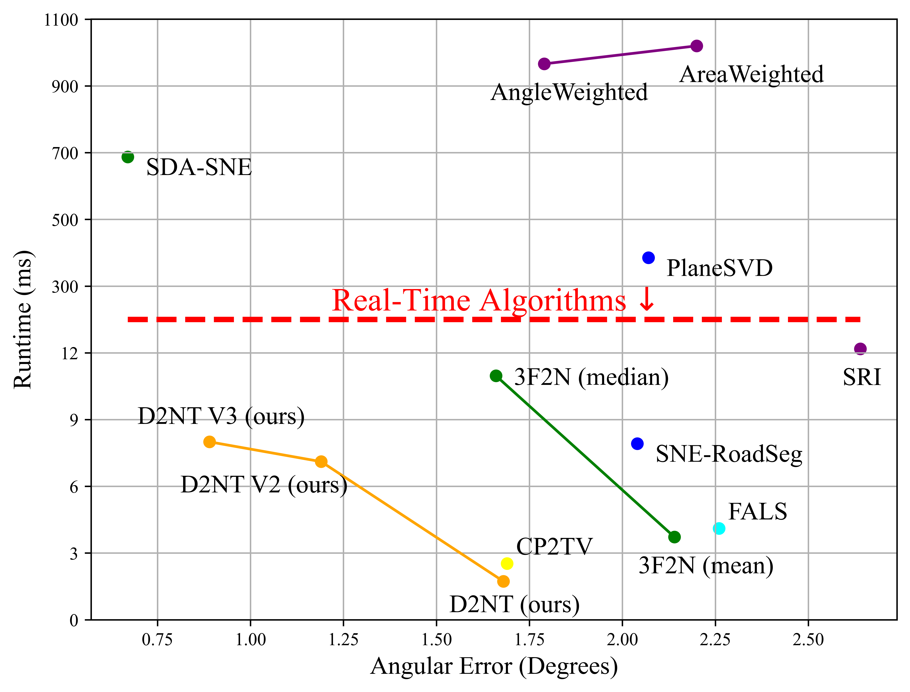

# D2NT: A High-Performing Depth-to-Normal Translator

This repo is the official implementation of the paper:
> ["D2NT: A High-Performing Depth-to-Normal Translator"](https://arxiv.org/abs/2304.12031)

[//]: # (> by [Yi Feng]&#40;https://github.com/fengyi233&#41;, [Bohuan Xue]&#40;https://github.com/byronsit&#41;,)
[//]: # (> and [Rui Fan]&#40;https://ruirangerfan.com/&#41;.)

> [[arXiv]](https://arxiv.org/abs/2304.12031) [[youtube]](https://youtu.be/) [[bilibili]](https://)

<p align="center">
  
</p>


# Prerequisites

+ matplotlib==3.5.1
+ numpy==1.24.2
+ opencv-python==4.5.1.48

# Dataset Preparation

Public real-world datasets generally obtain surface normals by local plane fitting,
which makes the surface normal ground truth unreliable. Therefore, we use the synthesis **3F2N dataset** provided
in this [paper](https://ieeexplore.ieee.org/document/9381580) to evaluate estimation performance.

The 3F2N dataset can be downloaded from: \
[BaiduDisk](https://pan.baidu.com/s/1BrzulgKfCCf-69mS-JSgNA?pwd=jveo) \
[GoogleDrive](https://drive.google.com/drive/folders/1TLj033oV0aplLE6xcQaSRcZpggDVTCHY) \
The dataset is organized as follows:

```
3F2N
 |-- Easy
 |  |-- android
 |  |  |-- depth
 |  |  |-- normal
 |  |  |-- params.txt
 |  |  |-- pose.txt
 |  |-- cube
 |  |-- ...
 |  |-- torusknot
 |-- Medium
 |  |-- ...
 |-- Hard
 |  |-- ...
```

# Demo

### 5.1  Python code
Navigate to [python]() directory and run `demo.py`, a result and the corresponding error map (degrees) will be displayed.
We also implement [3F2N SNE](https://ieeexplore.ieee.org/document/9381580) in python. The matlab and c++ implementation
can be found in this [repository](https://github.com/ruirangerfan/Three-Filters-to-Normal). 

It is recommended to run '**demo.py**' in your Python IDE instead of the Terminal for the sake of visualization.
You can change the parameter 'VERSION' to select the D2NT version.\
'**d2nt_basic**' represents for the depth-to-normal translator without any optimization method.\
'**d2nt_v2**' represents for the D2NT with Discontinuity-Aware Gradient (DAG) filter.\
'**d2nt_v3**' represents for the D2NT with DAG filter and MRF-based Normal Refinement (MNR) module.

### 5.2  Matlab code
Navigate to [matlab]() directory and run `demo.m`, a result and the corresponding error map (degrees) will be displayed.

### 5.3  C++ code
Navigate to [cpp]() directory and run `demo.cpp`, a result and the corresponding error map (degrees) will be displayed.


# Cite
This code is for non-commercial use; please see the license file for terms.

If you find our work useful in your research please consider citing our paper:

```
@inproceedings{icra_2023_d2nt,
	author      = {{Yi Feng, Bohuan Xue, Ming Liu, Qijun Chen, and Rui Fan}},
	title       = {{D2NT: A High-Performing Depth-to-Normal Translator}},
	booktitle   = {{IEEE International Conference on Robotics and Automation (ICRA)}},
	year        = {{2023}}
}
}
```